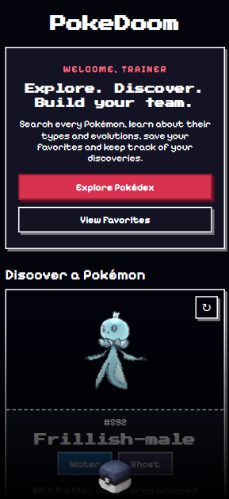
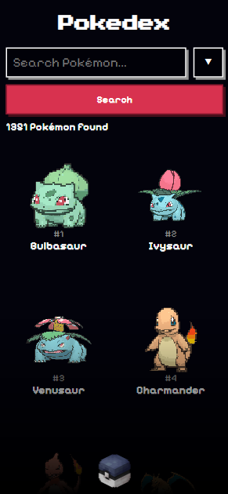
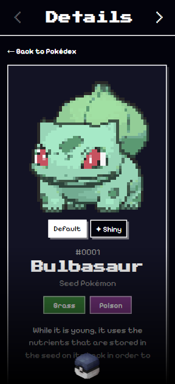
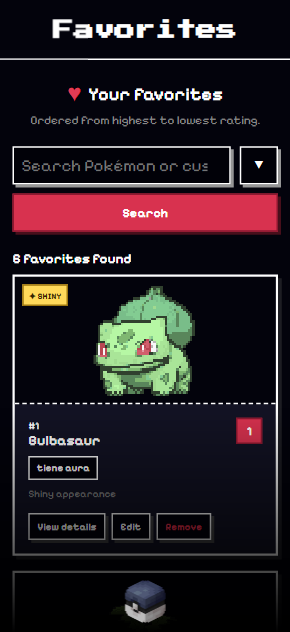
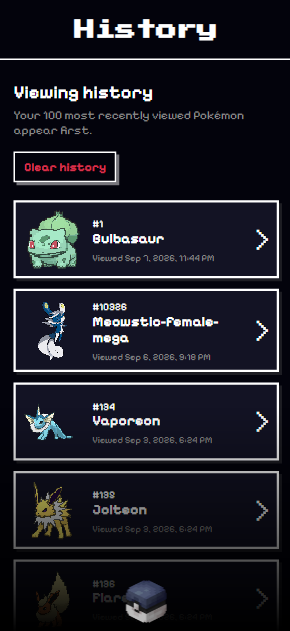
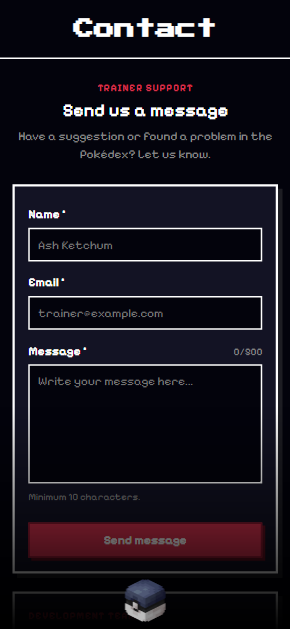

# PokeDoom

PokeDoom es una aplicación web **mobile-first** para explorar Pokémon utilizando [PokéAPI](https://pokeapi.co/). Permite buscar y filtrar Pokémon, consultar información detallada, guardar favoritos personalizados y mantener un historial local de visitas.

Proyecto desarrollado para el Trabajo Integrador del Módulo 1 de **Aplicaciones Móviles**.

## Enfoque del proyecto

El proyecto fue desarrollado como una aplicación web responsive utilizando React, con un enfoque mobile-first y especial atención a la adaptación de la interfaz a diferentes tamaños y orientaciones de pantalla.

La información de los Pokémon se obtiene dinámicamente desde PokéAPI mediante peticiones HTTP. Los datos propios del usuario, como favoritos, historial y preferencia de tema, se almacenan localmente mediante `localStorage`.

La interfaz fue desarrollada con CSS propio, sin utilizar frameworks o librerías de componentes visuales, buscando mantener una estética inspirada en Pokémon y videojuegos retro.

## Funcionalidades

- Pokédex paginada y adaptada al tamaño de pantalla.
- Búsqueda por nombre y filtros por tipo y región.
- Vista detallada de cada Pokémon con tipos, habilidades, estadísticas y cadena evolutiva.
- Visualización de debilidades, resistencias e inmunidades.
- Soporte para formas Mega, Primal y Gigantamax cuando están disponibles.
- Favoritos con rating, etiqueta personalizada y nota personal.
- Historial automático de los Pokémon visitados.
- Persistencia de favoritos, historial y tema mediante `localStorage`.
- Tema claro y oscuro.
- Estados de carga y manejo de errores.
- Diseño responsive con enfoque mobile-first.

## Capturas

### Inicio



### Pokédex



### Detalle de Pokémon



### Favoritos



### Historial



### Contacto



## Tecnologías utilizadas

- React
- JavaScript
- Vite
- CSS
- Fetch API
- PokéAPI
- OpenStreetMap
- localStorage

No se utilizan frameworks ni librerías de interfaz visual.

## Instalación y ejecución local

Es necesario tener instalados **Node.js** y **npm**.

```bash
git clone https://github.com/brunossaid/pokedoom.git

cd pokedoom

npm install

npm run dev
```

## Autores

- Agustín Cabeda — [cabeda52@gmail.com](mailto:cabeda52@gmail.com)

- Bruno Said — [ibrunosaid@gmail.com](mailto:ibrunosaid@gmail.com)
